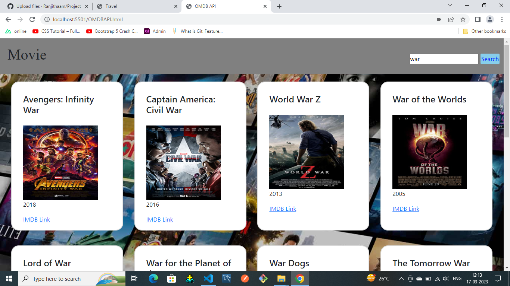

# **Movie-app **
Project using OMDB API and displayed the data in the Card .

# ** Technology use **
 == > HTML,CSS,Bootstrap,Javascript

# ** Working **
1.Fetch the API using Promise
2.Enter the Movie name in the Input field and click on the search button.
 Movie name with information is displayed in the card format.

 # ** Image **
 

