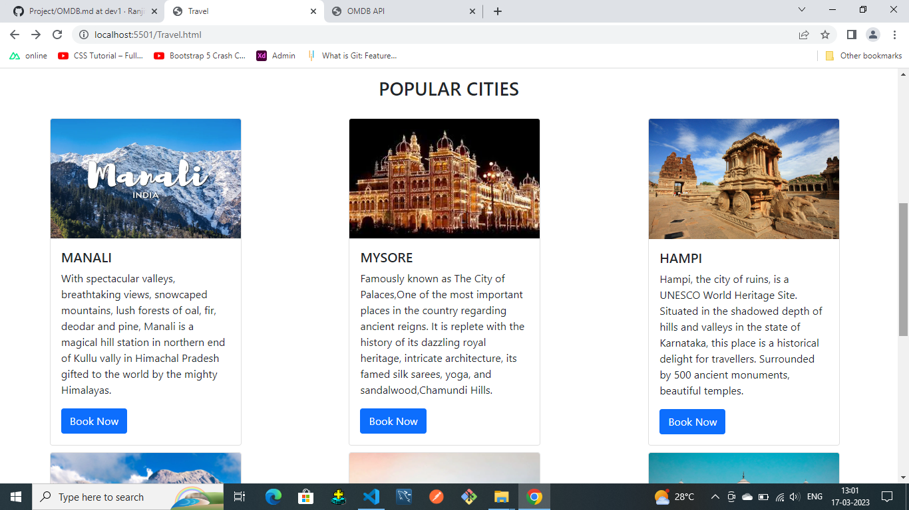

# ** Travel webpage **
Created an traveling webpage

# ** Technologies used **
HTML,CSS,Javascript,Bootstrap

 # ** Content of web-page **
1.Created Navbar with HOME,ABOUT and Register clickable links.
2.Used Carousel and added Some Images related to travelling.
3.Using card added Popular cities information clicking on BookNow it directs to Register Page.
4.In footer Added some social media.
5.Applied FormValidation to register page.

# ** Page-Image **

